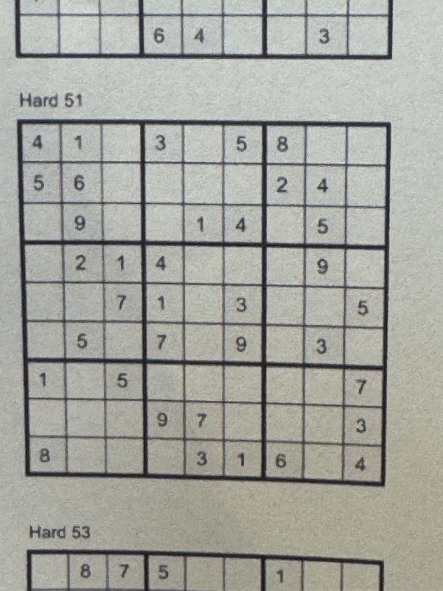
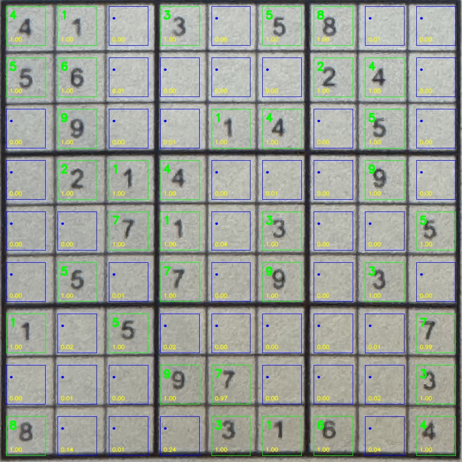
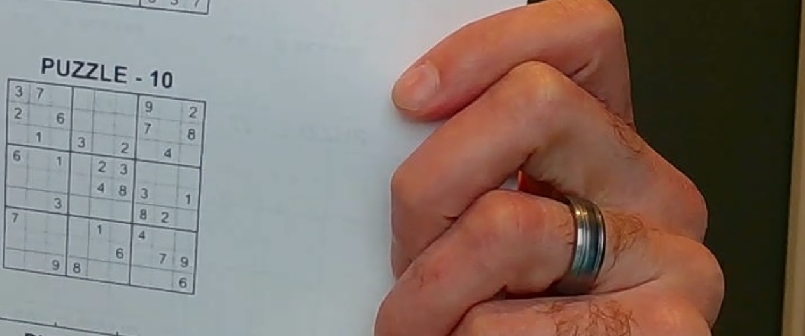
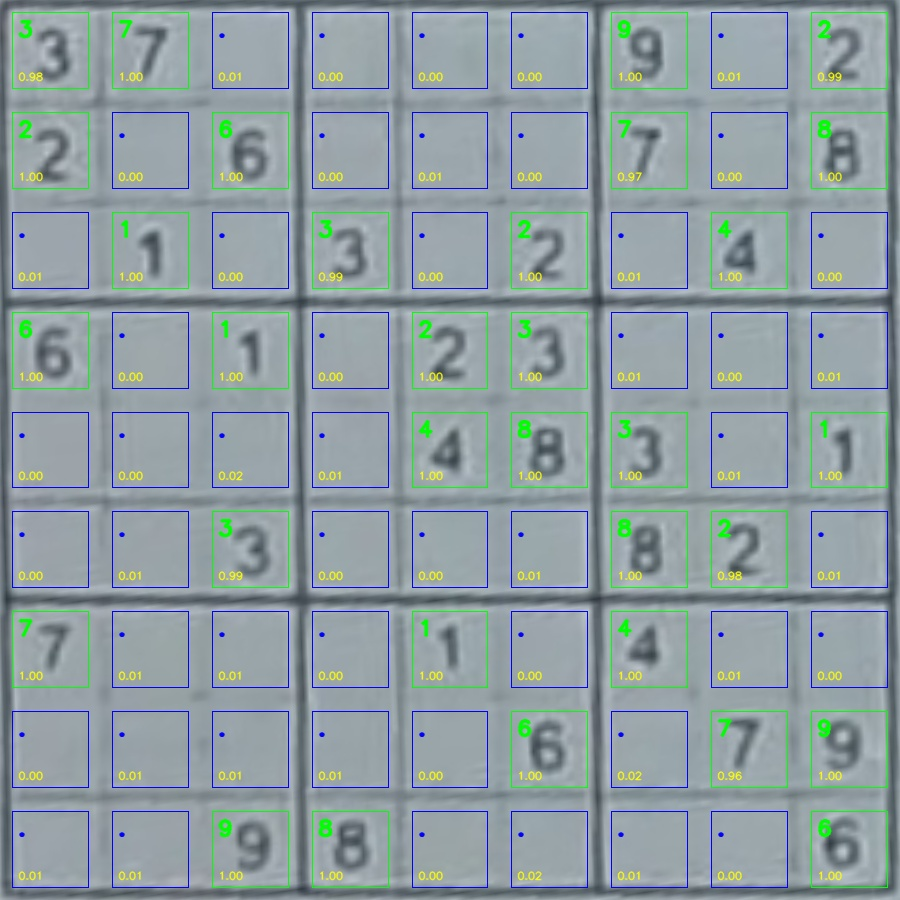

# Sudoku Image Solver

A frozen V1 system for reading **printed 9x9 Sudoku boards from real camera photos and webcam frames**.

Unlike synthetic-board or perfectly cropped close-up pipelines, this project targets real-photo OCR failure modes such as **small puzzles in frame, skew / tilt, blur, faint digits, and post-geometry quality loss**.

Using **440 training images** and **121 held-out evaluation boards**, the frozen system achieves:
- **85.95% board accuracy** (exact givens match)
- **98.84% cell accuracy**
- **233.2 ms mean** hot steady-state latency (**239.6 ms p95**)

This public repo starts from **labeled data / training-ready artifacts onward** and documents the frozen inference path, evaluation contract, artifact provenance, and final engineering decisions.

### Why lead with board accuracy?

Cell-level accuracy is useful, but it overstates end-user quality for Sudoku OCR.

If even one given is wrong, the board may be unusable. That makes **exact givens match** the more meaningful top-line metric for a practical Sudoku image solver.

In this repo:
- **Board accuracy** = exact match on all true given cells for a board
- **Cell accuracy** = mean full-board cell accuracy across all 81 cells

---
## What this repo is

This repo starts from **labeled data / training-ready artifacts onward**.

### In scope
- model training
- model evaluation
- calibration
- image-to-givens inference
- solver integration
- reproducible metrics
- debug and demo outputs

### Out of scope
- raw image-labeling workflow
- annotation tooling
- manual corner-label creation process
- full dataset archaeology / labeling history

This is a **clean public artifact** for the frozen system, not the full private project history.

---

## Problem setting

The target problem is not synthetic Sudoku or only perfectly cropped close-up boards.

The evaluation slice includes real-photo OCR difficulties such as:
- small puzzles in frame
- skew / tilt
- blur
- faint digits
- post-geometry quality loss

That makes this a more practical printed-camera-photo OCR task, but it also makes direct comparison to cleaner or synthetic benchmarks misleading.

---

## Frozen V1 pipeline

The frozen production path is:

1. **Letterbox-trained segmentation** for board localization
2. Predicted corners mapped back to **original image coordinates**
3. Final OCR warp from the **original-resolution image**
4. **Equal-split** 9x9 cell crops
5. Cleaned exported **occupancy baseline** artifact
6. **Chars74K transfer CNN** for digit recognition
7. Calibrated no-decode readout:
   - `occ_platt_digit_temp_no_decode`

### Frozen config

- `DEFAULT_WARP_SIZE = 900`
- `TRIM_FRAC = 0.12`
- `occ_threshold = 0.35`

### Frozen calibration

- Occupancy calibration: Platt scaling
- Digit calibration: temperature scaling

---
## Stagewise summary

### 1) Geometry
Board localization was the main early bottleneck. On `core_val`, the classical CV front end reached only **18.64%** exact board match, while segmentation reached **76.27%**, close to **77.97%** with oracle label corners. Classical CV worked when the board dominated the frame, but broke on small boards, clutter, blur, and competing rectangular structures, which is why segmentation became the primary front end.

### 2) Warping and crop strategy
After geometry improved, the next question was how to crop cells for OCR. A manual A/B review on 40 validation boards showed **equal split better on 11 boards**, **refit better on 3**, and **26 ties**, so equal split stayed the default OCR crop path. Refit remained useful for parser-side debugging and imperfect warps, but it was not a clear overall win for the training/inference path.

### 3) OCR model choice
The digit task turned out to be materially harder than occupancy. A linear softmax baseline reached only **73.8%** validation accuracy and clearly underfit the printed-digit problem, so the repo moved to a CNN. In the Day 21 benchmark, **Chars74K transfer** was the best setup at **94.53%** validation accuracy, ahead of **cells only (93.63%)**, **MNIST transfer (94.26%)**, and **EMNIST transfer (94.37%)**. That fit the task: printed OCR-style pretraining helped more than handwritten-only sources.

### 4) Stagewise vs end-to-end behavior
With labeled corners, the OCR stack was already very strong: **99.72%** occupancy accuracy and **99.59%** occupied-cell digit accuracy. But full pure-model inference still reached **84.30%** exact givens match and **97.09%** mean givens accuracy. That showed the remaining gap was not basic OCR capacity or heavier Sudoku logic; it was end-to-end robustness on hard real-photo boards, especially **filled cells being dropped as empty**.

### 5) Final V1 direction
The final V1 path keeps the components that won the stagewise decisions: **segmentation** for geometry, **equal-split crops** for OCR, a separate **occupancy stage**, and a **Chars74K-transfer CNN** for digits. Later controlled comparison also showed **letterbox-trained segmentation** outperforming **stretch-trained segmentation** on the downstream metric that mattered most (**85.12%** vs **82.64%** exact givens match), which is why letterbox became the locked production path.

---
## Major decisions that stuck

The final system was not the first baseline. The project tested multiple alternatives and froze the path that best balanced end-to-end accuracy, simplicity, and latency.

| Area | Frozen V1 choice | Alternatives not promoted to the public V1 path |
|---|---|---|
| Geometry front end | **Letterbox-trained segmentation** | Classical CV front end, stretch-trained segmentation, adaptive-warp default |
| OCR warp path | **Warp from original-resolution image** | Warp from resized segmentation image |
| OCR crop method | **Equal-split crops** | Refit / grid-box default path |
| Occupancy stage | **Cleaned exported baseline** | Later occupancy variants that did not clearly earn promotion |
| Digit recognizer | **Chars74K transfer CNN** | Linear softmax baseline, weaker abandoned variants |
| Final readout | **`occ_platt_digit_temp_no_decode`** | Default false-empty override, CLAHE-first path, aggressive constrained-decoding default |

### Why this readout stayed

The final readout matched the strongest practical success behavior while staying simpler and slightly lower-latency than the closest competing no-decode variant.

---

## Benchmark context
> [!IMPORTANT]
> **Do not read this as a strict leaderboard.**
> These systems were trained and evaluated on different datasets, with different image quality, framing, board size, distortion, and reporting rules. Several published approaches also used cleaner images with less noise and larger boards.
>
> This table is included to show the broader landscape and provide rough metric context, not to claim exact apples-to-apples ranking.
>
> This repo’s evaluation includes harder real-photo cases such as **small puzzles in frame**, **skew / tilt**, **blur / faint digits**, and other post-geometry OCR difficulties, so direct comparison to cleaner close-up datasets can be misleading.

| System | Cell accuracy | Board accuracy |
|---|---:|---:|
| **This repo** | **98.84%** | **85.95%** |
| **[Kainos Sudoku CV project](https://www.kainos.com/insights/blogs/ai-academy-capstone-projects--improving-document-data-extraction-through-contextualisation-computer-vision-based-sudoku-solver)** | — | **93.8%*** |
| **[PBCS / Sudoku Assistant (2024)](https://link.springer.com/article/10.1007/s10601-024-09372-9)** | **99.2%** | **94.84%** |
| **[Wicht / smartphone Sudoku dataset](https://github.com/wichtounet/sudoku_dataset)** | — | **87.5%**† |
| **[mineshpatel1/sudoku-solver](https://github.com/mineshpatel1/sudoku-solver)** | — | **99.2%** |
| **[Recurrent Transformer (ICLR 2023)](https://openreview.net/forum?id=udNhDCr2KQe)** | **99.77%** | **93.5%** |
| **[NeurASP](https://www.ijcai.org/proceedings/2020/0243.pdf)** | **96.9%** | **66.5%** |
| **[AS2 (2026)](https://arxiv.org/abs/2603.18436)** | **99.89%** | **100.0%**‡ |

\* Reported on “starting boards” only, which is closer to this repo’s intended use case than completed-board evaluation, but it is still a different dataset and protocol.  
† Wicht’s dataset page reports 12.5% error on one real-image setup, equivalent to 87.5% accuracy. This is a historical real-camera benchmark, not the same eval protocol as this repo.  
‡ AS2 reports 100% constraint satisfaction on Visual Sudoku, which is a synthetic / normalized benchmark and not directly comparable to a real printed-camera-photo OCR pipeline.

### How to read this table
This table is meant as **context**, not a strict leaderboard.

The most meaningful comparisons are:
- other systems that read Sudoku from **real images**
- other systems that report **board-level** accuracy, not only digit accuracy
- systems whose task is closer to **printed-camera-photo OCR**, not only synthetic Visual Sudoku

---
## Example predictions

Below are two real examples from the project showing the geometry step and the post-warp cell-level prediction overlay.

### Example 1 — `cv_0002`

**Pre-warp / geometry debug**



**Post-warp / prediction overlay**



### Example 2 — `cv_0003`

**Pre-warp / geometry debug**



**Post-warp / prediction overlay**



---

## What is solved, and what is still hard

### Solved enough for V1

- geometry is solved enough for V1
- segmentation is the correct production front end
- original-image warp is the correct OCR warp path
- the current occupancy stage is good enough
- the current digit recognizer is good enough

### Remaining failure pattern

The remaining misses are concentrated in a minority of hard boards.

The dominant remaining failure mode is still:

**filled cells being dropped as empty**

Hard cases cluster around:
- small boards inside larger images
- skew / tilt
- blur
- faint digits
- post-geometry quality loss
- a few real ambiguities such as **6 vs 8**

### What this repo does not claim

- live AR-grade temporal stability
- fully solved scene-level board discovery
- a completely solved last-mile OCR problem

This is a strong frozen V1 system, not a claim that Sudoku image understanding is finished.

---

## Reproducibility and evaluation note

The repo is intentionally frozen around a narrow V1 path. A refactor should preserve behavior and should not silently swap artifacts or configs.

### Frozen artifact family

- `models/frozen_v1/segmentation/letterbox_seg_checkpoint.pt`
- `models/frozen_v1/occupancy/occupancy_model.npz`
- `models/frozen_v1/digits/digit_cnn.pt`
- `models/frozen_v1/calibration/occ_calibration.json`
- `models/frozen_v1/calibration/digit_calibration.json`
- `models/frozen_v1/calibration/calibration_manifest.json`

### Official evaluation policy

- While appended to the training dataset, images from the Kaggle dataset are excluded from the public reported slice
- the primary metric is **exact givens match**
- supporting metrics include mean givens accuracy, mean full-board cell accuracy, legality failure rate, and latency

### Running the frozen evaluation

The full frozen evaluation expects access to the original labeled data tree and raw images. Those assets are not bundled into this public repo.

```bash
python scripts/run_frozen_eval_v1.py \
  --data-root /path/to/private_sudoku_data \
  --splits core_val core_test \
  --exclude-kaggle

pytest -q tests/test_metric_regression.py
```

---

## Repository layout

```text
models/frozen_v1/
  segmentation/
  occupancy/
  digits/
  calibration/
  manifest.json

src/sudoku_solver/
  frozen_config.py
  inference.py

scripts/
  train_segmentation_v1.py
  freeze_calibration_v1.py
  run_frozen_eval_v1.py

tests/
  goldset/
  test_goldset.py
  test_metric_regression.py

docs/
  MODEL_PROVENANCE.md
```

---

## Summary

This repo is meant to demonstrate three things:

1. A practical Sudoku OCR system for real photos, not just clean synthetic boards
2. A clear frozen production path with explicit artifact and metric discipline
3. Honest end-to-end evaluation where **board accuracy** is treated as the metric that matters most

## Reproducibility note

The frozen model artifacts live in this repo.

Full metric reproduction requires access to the labeled board JSONs and raw evaluation images used by the project. Set `SUDOKU_DATA_ROOT` to the external dataset root, or pass `--data-root` directly to `scripts/run_frozen_eval_v1.py`.

Example:

```bash
export SUDOKU_DATA_ROOT=/path/to/private_sudoku_data
pytest -q tests/test_metric_regression.py
python scripts/run_frozen_eval_v1.py --splits core_val core_test --exclude-kaggle
```
