# Sudoku Image Solver

An end-to-end system for reading **printed 9×9 Sudoku boards from real camera photos and webcam frames**, built for harder real-world conditions than synthetic-only or close-up-only pipelines. Using **440 training images** and **121 held-out evaluation boards**, the frozen system achieves **85.95% board accuracy** (exact givens match), **98.84% cell accuracy**, and **233.2 ms mean** hot steady-state latency (**239.6 ms p95**). The project is designed around real-photo OCR failure modes such as **small puzzles in frame, skew / tilt, blur, faint digits, and post-geometry quality loss**, and the repo documents the full frozen inference path, evaluation contract, artifact provenance, and final engineering decisions behind the shipped system.
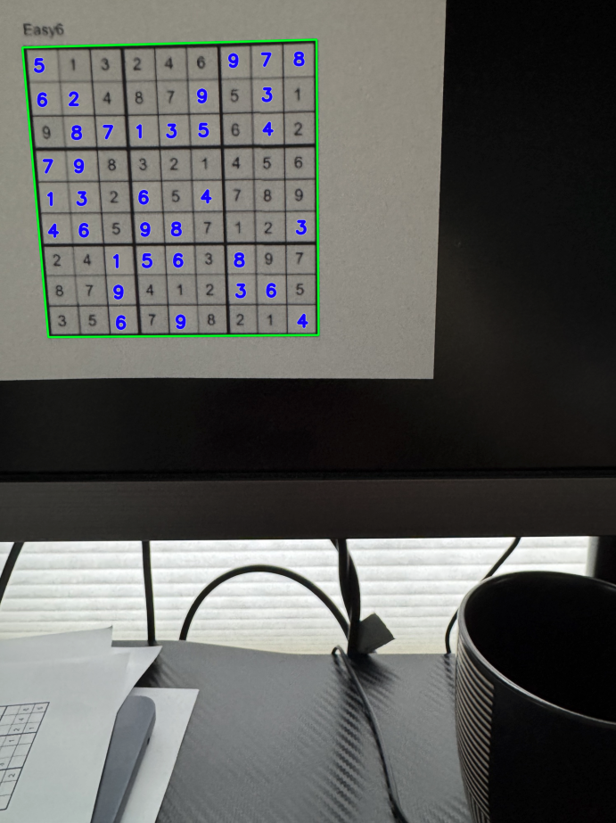

## Why board accuracy is the top-line metric

The model makes predictions at the **cell level**, but the end user experiences success or failure at the **board level**.

For Sudoku OCR, **cell accuracy alone can be misleading**. A system can be highly accurate across all evaluated cells in the dataset and still fail in practice if it makes even one wrong prediction on a given board.

That is why this project leads with **board accuracy**, defined as **exact match on all true given cells for a board**. In contrast, **cell accuracy** measures correctness across all evaluated cells in the reported evaluation slice. Cell accuracy is still useful for debugging and model comparison, but it overstates end-user quality because a single wrong given can make an otherwise correct-looking board unusable for solving or downstream reasoning.

In this repo:
- **Board accuracy** = exact match on all true given cells for a board
- **Cell accuracy** = accuracy across all evaluated cells in the reported evaluation slice

This project therefore treats **exact givens match** as the primary metric and uses cell-level metrics as supporting diagnostics.

## Problem setting

This project is not aimed at synthetic Sudoku alone and not limited to perfectly cropped close-up boards. The target task is **reading printed 9×9 Sudoku boards from real camera photos and webcam frames**, where the board may occupy only a small part of the image and the downstream OCR problem is shaped by real capture conditions rather than clean benchmark assumptions.

The reported evaluation includes harder real-photo cases such as **small puzzles in frame, skew / tilt, blur, faint digits, and post-geometry quality loss**. Those conditions make the task more representative of practical camera-based Sudoku OCR, but they also make direct comparison to cleaner or synthetic benchmarks misleading.

The goal of the repo is therefore a **standalone real-image Sudoku OCR system** with a frozen inference path and honest board-level evaluation, not a claim that the problem is solved under all imaging conditions. Because the image regime is not restricted to close-up-only capture, the same setup also leaves room for future AR-style use, but this repo is framed first and foremost as a robust standalone OCR project.

## Frozen production pipeline

The frozen production path is intentionally decomposed into **geometry → OCR preparation → cell-level recognition → calibrated readout** because those stages fail for different reasons and benefit from being measured separately.

1. **Letterbox-trained segmentation** for board localization  
   The system first predicts the Sudoku board region in the full image using a segmentation model trained with aspect-ratio-preserving resize and padding.

2. **Predicted corners mapped back to original image coordinates**  
   Board corners are recovered in the original image coordinate system rather than keeping OCR tied to the resized segmentation image.

3. **Final OCR warp from the original-resolution image**  
   After localization, the board is rewarped from the original image to preserve as much detail as possible for downstream OCR.

4. **Equal-split 9×9 cell crops**  
   The warped board is divided into 81 fixed cell crops using the equal-split path selected for the frozen system.

5. **Occupancy stage**  
   Each cell is first classified as **empty** or **filled** using the cleaned exported occupancy artifact.

6. **Digit recognition stage**  
   Filled cells are passed to the **Chars74K-transfer CNN** for digit classification.

7. **Calibrated final readout**  
   Occupancy probabilities are Platt-scaled, digit logits are temperature-scaled, and the final frozen readout uses:

   - `occ_platt_digit_temp_no_decode`

### Frozen config

- `DEFAULT_WARP_SIZE = 900`
- `TRIM_FRAC = 0.12`
- `occ_threshold = 0.35`

### Frozen calibration

- Occupancy calibration: **Platt scaling**
- Digit calibration: **temperature scaling**

## Stagewise summary

### 1) Geometry: finding the board

The first problem was simply finding the Sudoku board reliably in a full image. The project started with a **classical computer-vision detector** based on contours and quadrilateral selection. That baseline was useful for getting the pipeline started, but it was not reliable enough for the real cases that mattered: when the puzzle was small in frame, blurred, cluttered, or competing with other rectangular structures.

On a 59-image held-out set, the classical front end reached only **18.64%** exact board match, which made it too brittle to serve as the production geometry path. The project therefore moved to a **trained segmentation model** using the existing board-corner labels already available in the dataset. That immediately raised exact board match to **76.27%**, close to **77.97%** when the system was given the **ground-truth board corners** directly.

That result was strong, but it also made an important point: **exact board match is a very strict geometry metric**. For downstream use, the board does not need to be a perfect label-level match — it needs to be warped accurately enough that the cell crops are still usable. Once the project shifted from asking “is this a perfect board match?” to asking “is this geometry good enough to support OCR?”, the more relevant result became clear.

The next refinement was choosing how to preprocess images before segmentation. The earlier segmentation path resized every image to a square by **stretching** it, which changes the image geometry. The later **letterbox** path instead resized the image while **preserving aspect ratio**, then added padding to fit the model’s square input size. In practice, that preserved board shape better on wide, tall, and smaller-in-frame images.

A controlled comparison showed that **letterbox-trained segmentation** was the better production path. It got **97.52%** of boards with all 4 corners within **25 px**, versus **93.39%** for the stretch-trained model, and it also produced better end-to-end exact givens match (**85.12%** vs **82.64%**). That is why **letterbox segmentation** became the frozen production front end.

### 2) Turning the board into OCR-ready cells

Once the board corners are known, the system applies a **perspective transform (homography)** to map the board into a clean top-down square. That square board image is then divided into a 9×9 grid to produce the 81 cell crops used for downstream recognition.

The next question was how those cell crops should be defined. The two main options were simple **equal-split crops** versus **refit / grid-box crops** that try to follow the inner lattice more closely.

Refit was appealing because it could help when the warp was imperfect, but it also added complexity and was not obviously better on most boards. A manual A/B review on **40 validation boards** showed that equal split was already strong enough: **11 boards favored equal split, 3 favored refit, and 26 were ties**. Refit remained useful for parser-side debugging and imperfect-warp analysis, but it was not a large enough win to justify making it the default public inference path.

That is why the frozen system uses **equal-split crops** as the default OCR path.

### 3) OCR: why the system uses two recognition stages

After the board is warped and split into 81 cells, the problem becomes **optical character recognition (OCR)**: deciding what each cell contains.

The system handles this in two stages:
1. **Occupancy**: is the cell empty or filled?
2. **Digit recognition**: if the cell is filled, which digit is it?

That split was intentional. Empty-vs-filled is a simpler classification problem than 10-way digit recognition, and the two tasks fail differently. Separating them makes the system easier to tune and, more importantly, makes the real bottleneck visible when something goes wrong.

After a small cleanup pass that removed **80 obviously broken / noisy occupancy crops**, the occupancy model was already strong enough to keep as the main first stage, reaching **98.47%** validation accuracy with **99.01%** precision on filled cells and **97.14%** recall on filled cells.

For digits, the project first tried a **linear softmax baseline**, which reached only **73.8%** validation accuracy and clearly underfit the printed-digit task. The confusion pattern was also telling: errors like **3→2**, **7→2**, and **8→6** showed that the model was not learning shape well enough for the harder printed-digit cases. The next step was to move to a **CNN**, which was much better aligned with the visual nature of the problem. In the final digit-model benchmark, the best setup was **Chars74K transfer** at **94.53%** validation accuracy, ahead of **cells only (93.63%)**, **MNIST transfer (94.26%)**, and **EMNIST transfer (94.37%)**.

The key reason for the two-stage OCR path is therefore not a simple multiplication of benchmark numbers from different datasets. It is that the split matches the structure of the problem, improves calibration and thresholding, and makes downstream error analysis much more actionable.

### 4) Stage-isolated performance vs full end-to-end performance

One important question was whether the system still had a basic OCR problem, or whether the remaining failures were caused by end-to-end compounding errors.

To answer that, the project measured OCR in a **stage-isolated setting** by giving the system the **ground-truth board corners** directly. Under that setup, geometry is effectively removed from the equation, so the numbers reflect OCR quality rather than board-finding quality. In that setting, the OCR stack was already very strong on the combined held-out evaluation:
- **99.72%** occupancy accuracy
- **99.59%** occupied-cell digit accuracy

But with the full **end-to-end** system — where the model must first find the board, warp it, split it into cells, and then read it — the system reached:
- **84.30%** exact givens match
- **97.09%** mean givens accuracy

That gap showed that the remaining problem was **not** basic OCR capacity and **not** a lack of heavier Sudoku logic. The main issue was end-to-end robustness on hard real-photo boards. More specifically, the dominant remaining failure mode was **filled cells being dropped as empty**: the combined held-out evaluation logged **83 `missed_as_empty` errors** versus only **19 `wrong_digit` errors**. The two-stage OCR design made that bottleneck visible.

### 5) Final direction

By this point, the project had enough evidence to stop treating the system as an open-ended experiment and lock a production path.

The frozen system uses:
- **letterbox-trained segmentation** for geometry
- **original-image OCR warp** after board localization
- **equal-split crops** for OCR
- a separate **occupancy stage**
- a **Chars74K-transfer CNN** for digits
- a calibrated no-decode readout

The final OCR-warp choice was also validated directly. Switching from the resized segmentation image to an **original-image OCR warp** improved downstream behavior while keeping latency roughly flat. On one held-out slice, mean givens accuracy improved from **0.9519** to **0.9619**, `missed_as_empty` dropped from **68** to **52**, `wrong_digit` dropped from **20** to **17**, and legality failure rate improved from **13.6%** to **11.9%**. On a second held-out slice, exact givens match improved from **0.8710** to **0.8871**, `wrong_digit` dropped from **10** to **5**, and legality failure rate improved from **6.45%** to **4.84%**.

A conservative false-empty override was tested as well, but it did **not** justify becoming the default path: it added major latency without meaningful held-out improvement. That is why the frozen system locks in **letterbox segmentation + original-image OCR warp + equal-split crops + separate occupancy + Chars74K-transfer CNN + calibrated no-decode readout** as the final production direction.

## Major decisions that stuck

The final system was not the first baseline. The project tested multiple alternatives and froze the path that best balanced **board-level accuracy, robustness, simplicity, and latency**.

| Area | Frozen choice | Alternatives not promoted |
|---|---|---|
| Geometry front end | **Letterbox-trained segmentation** | Classical CV detector, stretch-trained segmentation, adaptive-warp default |
| OCR warp path | **Warp from original-resolution image** | Warp from the resized segmentation image |
| OCR crop method | **Equal-split crops** | Refit / grid-box default path |
| Occupancy stage | **Cleaned exported occupancy baseline** | Later occupancy variants that did not clearly justify promotion |
| Digit recognizer | **Chars74K-transfer CNN** | Linear softmax baseline, cells-only CNN, MNIST transfer, EMNIST transfer, Chars74K-only |
| Final readout | **Calibrated no-decode readout** (`occ_platt_digit_temp_no_decode`) | Conservative false-empty override, heavier constrained-decoding default |

### Why this readout stayed

The final readout stayed because it matched the strongest practical behavior without adding unnecessary complexity. More aggressive correction logic was tested, but it did not deliver enough held-out improvement to justify the extra latency and moving parts.


## Researched approaches

> [!IMPORTANT]
> **Do not read this as a strict leaderboard.**
> These systems were trained and evaluated on different datasets, with different image quality, framing, board size, distortion, and reporting rules. The sample images below are included to make those differences more obvious at a glance.
>
> Several published approaches also used cleaner images with less noise and larger boards. This table is included to show the broader landscape and provide rough metric context, not to claim exact apples-to-apples ranking.

| System | Sample image | Cell accuracy | Board accuracy |
|---|---|---:|---:|
| **This repo** | 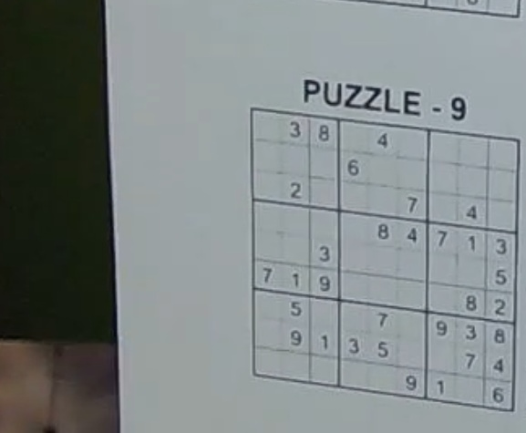 | **98.84%** | **85.95%** |
| **[Kainos Sudoku CV project](https://www.kainos.com/insights/blogs/ai-academy-capstone-projects--improving-document-data-extraction-through-contextualisation-computer-vision-based-sudoku-solver)** | 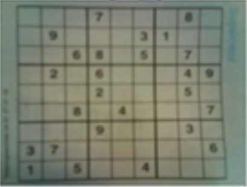 | — | **93.8%*** |
| **[PBCS / Sudoku Assistant (2024)](https://link.springer.com/article/10.1007/s10601-024-09372-9)** | 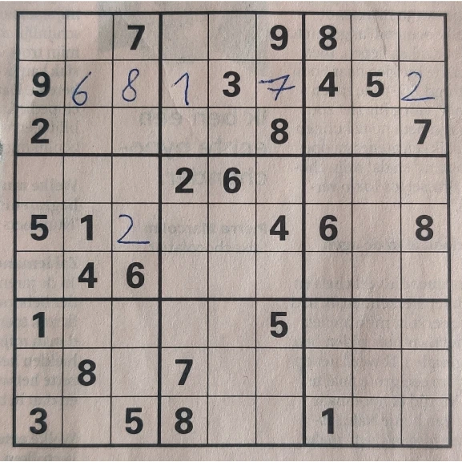 | **99.2%** | **94.84%** |
| **[Wicht / smartphone Sudoku dataset](https://github.com/wichtounet/sudoku_dataset)** | 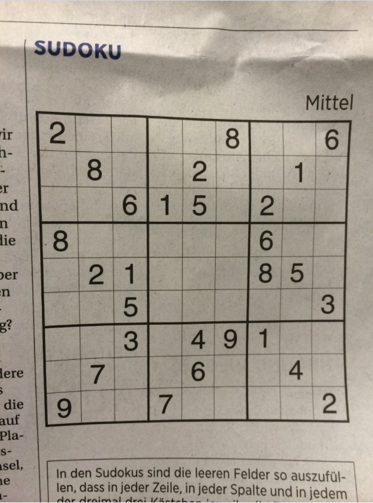 | — | **87.5%**† |
| **[mineshpatel1/sudoku-solver](https://github.com/mineshpatel1/sudoku-solver)** | 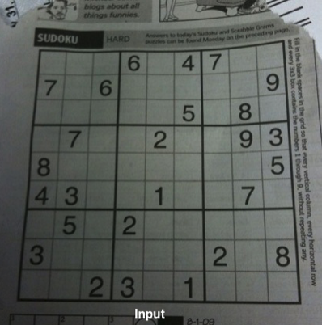 | — | **99.2%** |
| **[Recurrent Transformer (ICLR 2023)](https://openreview.net/forum?id=udNhDCr2KQe)** | 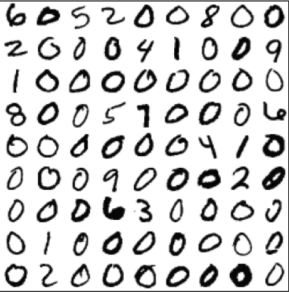 | **99.77%** | **93.5%** |
| **[NeurASP](https://www.ijcai.org/proceedings/2020/0243.pdf)** | 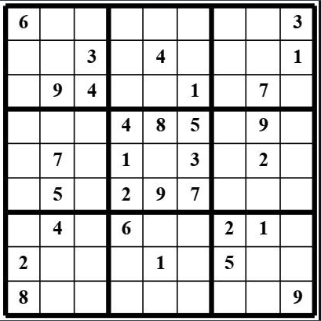 | **96.9%** | **66.5%** |
| **[AS2 (2026)](https://arxiv.org/abs/2603.18436)** | 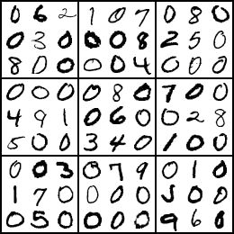 | **99.89%** | **100.0%**‡ |

\* Reported on “starting boards” only, which is closer to this repo’s intended use case than completed-board evaluation, but it is still a different dataset and protocol.  
† Wicht’s dataset page reports 12.5% error on one real-image setup, equivalent to 87.5% accuracy. This is a historical real-camera benchmark, not the same eval protocol as this repo.  
‡ AS2 reports 100% constraint satisfaction on Visual Sudoku, which is a synthetic / normalized benchmark and not directly comparable to a real printed-camera-photo OCR pipeline.

### What kinds of approaches are included here?

This table mixes several different regimes: **real-photo pipelines**, **public repo implementations with their own data and reporting choices**, and **synthetic / normalized visual Sudoku benchmarks**. The sample-image column is included so those differences are visible immediately instead of being buried in footnotes.

### How to read this table

The most meaningful comparisons are:
- other systems that read Sudoku from **real images**
- other systems that report **board-level** accuracy, not only digit accuracy
- systems whose task is closer to **printed-camera-photo OCR**, not only synthetic Visual Sudoku


## Reproducibility and evaluation

This repo is intentionally frozen around a narrow production path. The goal is not to preserve every historical experiment; it is to preserve a **reproducible evaluated system** whose behavior can be checked against the reported metrics. Refactors should therefore preserve outputs and should not silently swap artifacts, thresholds, or evaluation rules. 

### Frozen artifact family

The frozen system depends on a small, explicit artifact set:

- `models/frozen_v1/segmentation/letterbox_seg_checkpoint.pt`
- `models/frozen_v1/occupancy/occupancy_model.npz`
- `models/frozen_v1/digits/digit_cnn.pt`
- `models/frozen_v1/calibration/occ_calibration.json`
- `models/frozen_v1/calibration/digit_calibration.json`
- `models/frozen_v1/calibration/calibration_manifest.json`

These artifacts define the production geometry path, OCR stack, and final calibrated readout used for the reported results. 

### Official evaluation policy

The public reported metrics follow a narrow evaluation contract:

- the primary metric is **exact givens match**
- supporting metrics include **mean givens accuracy**, **mean full-board cell accuracy**, **legality failure rate**, and **latency**
- **Kaggle-tagged images are excluded** from the public reported metrics
- raw labeled data and original source images are **not bundled** into this public repo

The point of this policy is to keep the published numbers tied to a stable held-out slice and a stable frozen system. 

### Running the frozen evaluation

The full frozen evaluation expects access to the external labeled data tree and raw images. Set `SUDOKU_DATA_ROOT` to that dataset root, then run:

```bash id="x97hbx"
export SUDOKU_DATA_ROOT=/path/to/private_sudoku_data
python scripts/run_frozen_eval_v1.py --splits core_val core_test --exclude-kaggle
pytest -q tests/test_metric_regression.py
```

## Qualitative example

The example below shows what the full pipeline looks like on a real image after board localization, perspective correction, and cell-level recognition. It is included as a concrete qualitative check, not as a substitute for the held-out metrics reported above.

### `cv_0003`

**Pre-warp / geometry debug**

This view shows the detected board in the original image before the final perspective transform.


**Post-warp / prediction overlay**

This view shows the warped top-down board with the model’s cell-level predictions overlaid.


## Current strengths and remaining limits

### Current strengths

The project is now strong in the parts of the pipeline that matter most for a practical standalone Sudoku OCR system:

- **Board localization is no longer the main bottleneck.** The final **letterbox-trained segmentation** path is strong enough to support reliable downstream OCR on the target image regime.
- **The OCR path preserves more useful image detail.** After localization, the system maps the predicted board corners back to the **original image** and performs the final OCR warp from that higher-detail source rather than from the resized segmentation image.
- **The frozen OCR stack is built on the right decomposition.** A separate **occupancy stage** plus **digit recognizer** made it possible to isolate the real error modes and choose a cleaner production path.
- **Stage-isolated OCR is already very strong.** When the system is given the correct board geometry, it reaches **99.72% occupancy accuracy** and **99.59% occupied-cell digit accuracy** on the combined held-out evaluation.

### Remaining limits

The main remaining challenge is no longer broad board finding. It is **image-detail-limited OCR on hard boards**.

As puzzles get **smaller and farther from the camera**, the available visual information drops. That effect is compounded by **skew / tilt, blur, faint digits, and post-geometry quality loss**. In those cases, some cell crops are close to the limit of what can be recovered reliably, and the remaining mistakes are often hard even for manual inspection.

This matters because the system predicts at the **cell level**, but success is judged at the **board level**. A single wrong digit or dropped given can invalidate the entire board. That is why the remaining weakness is best described as **hard-case digit and occupancy inference under limited image detail**, not broad model collapse.

In other words: the system is already strong when the board is readable, but the hardest remaining boards are the ones where the image itself provides limited signal.


## Failure modes

Most of the remaining misses come from a small number of hard boards, not broad failure across the dataset. Ordered by practical impact, the residual errors fall into three buckets.

### 1) Wrong digit inference on small / low-quality puzzles (**13 / 121 boards**)

The largest remaining bucket is digit confusion on smaller, farther-away puzzles where the final OCR crop has limited detail. After segmentation, the system already performs the final OCR warp on the **original image resolution**, so the remaining mistakes are generally reasonable ambiguities such as **8 vs 6** or **9 vs 6**, not obvious model collapse.

A more aggressive correction layer that compares digits against Sudoku consistency constraints could reduce some of these errors, but it would add latency and complexity and is intentionally not part of the default production path.

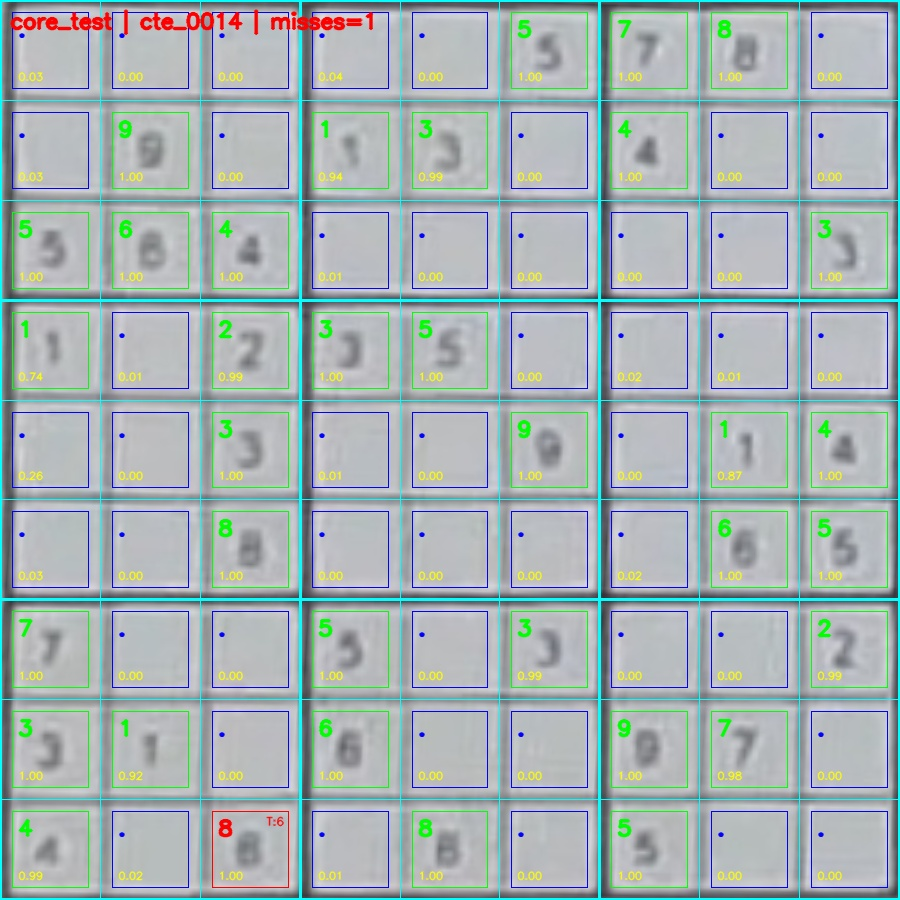

### 2) Residual warp / localization failures (**3 / 121 boards**)

These are usually smaller, farther-away boards where the puzzle occupies too few pixels before OCR. In these cases, the board is found, but the final warp is not clean enough to preserve all of the detail needed for reliable downstream recognition.

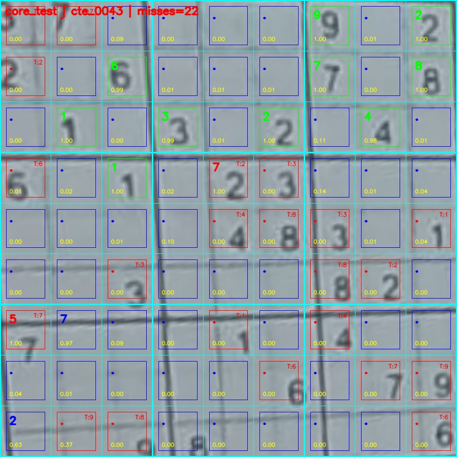

### 3) Rare occupancy failure (**1 / 9,801 cells**)

Occupancy errors are now rare. Across **121 evaluation boards** (**9,801 total cells**), this issue appeared once. The representative failure below is included for completeness, but it is not a major driver of the remaining error.

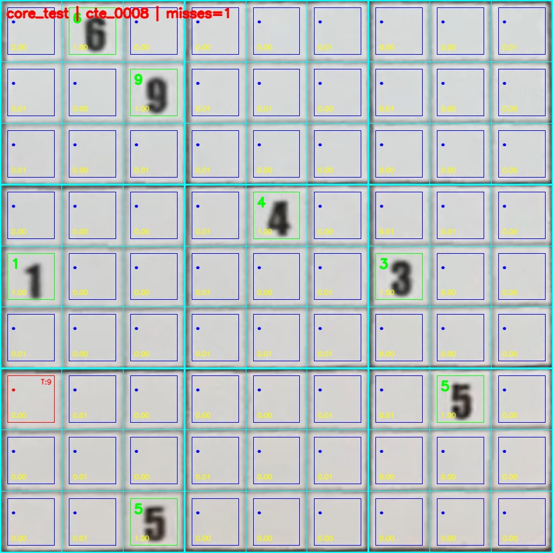

### Practical takeaway

The remaining misses are concentrated in a narrow hard-case slice: **small / distant boards, reduced stroke quality, and a few visually ambiguous digits**. That is why the next likely gains come from better hard-case OCR handling, not from reworking the overall architecture.


## Repository layout

The repo is intentionally kept small at the top level so the frozen system is easy to inspect and reproduce:

```text id="21hkgj"
docs/                  Supporting notes, figures, and README assets
models/frozen_v1/      Frozen production artifacts for geometry, OCR, and calibration
scripts/               Evaluation, training, and artifact-freezing entry points
src/sudoku_solver/     Core inference package and frozen configuration
tests/                 Goldset and metric-regression checks

DATASETS.md            Dataset description and data-access notes
FREEZE_CONTRACT.md     Frozen artifact and evaluation contract
README.md              Project overview and technical narrative
pyproject.toml         Package metadata and test configuration
requirements.txt       Minimal dependency list
```


## Summary

This repo demonstrates three things:

1. a practical **real-image Sudoku OCR system** for printed 9×9 boards captured from camera photos and webcam frames
2. a **frozen production path** with explicit artifact, calibration, and evaluation discipline
3. honest **board-level evaluation and failure analysis**, including where the remaining errors come from and why they happen
